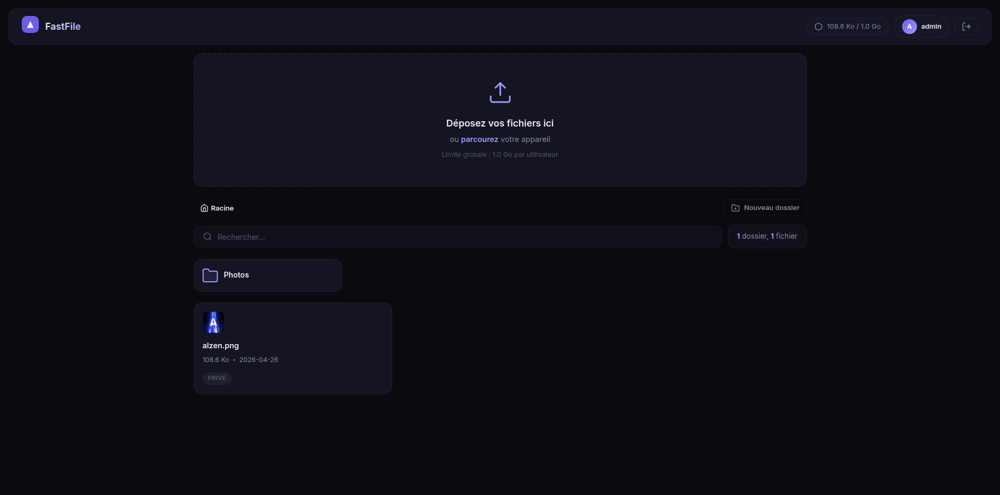

# 🚀 FastFile

**FastFile** est un gestionnaire de fichiers et CDN auto-hébergé, conçu avec une interface moderne en "Glassmorphism". Il vous permet de stocker, organiser et partager vos fichiers facilement depuis votre propre serveur.



## ✨ Fonctionnalités Principales

- 📁 **Gestion de Fichiers & Dossiers** : Uploadez des fichiers individuels ou des dossiers complets (avec glisser-déposer).
- 🔗 **Partage Avancé** : Rendez vos fichiers ou dossiers publics avec un système de partage hautement configurable :
  - **Slugs personnalisés** (`/share/mon-fichier`)
  - **Protection par mot de passe**
  - **Date d'expiration automatique**
- 🎨 **Interface Premium** : Design sombre, élégant, utilisant des effets de verre (Glassmorphism) et des micro-animations pour une expérience utilisateur optimale.
- ⚡ **CDN Intégré** : Liens directs pour intégrer vos images, vidéos et autres assets directement sur d'autres sites web (`/share/raw/...`).
- 👥 **Multi-Utilisateurs & Quotas** : Inscription des utilisateurs, gestion via un panneau d'administration et configuration de quotas d'espace de stockage personnalisés (Go, Mo, etc.).
- 🐳 **Déploiement Facile** : Prêt pour Docker avec une configuration via un simple fichier `.env`.

---

## 🛠️ Installation (via Docker)

Le moyen le plus simple et recommandé pour installer FastFile est d'utiliser Docker et Docker Compose.

### 1. Préparer l'environnement

Créez un dossier pour votre installation et déplacez-vous dedans :
```bash
mkdir fastfile && cd fastfile
```

Créez un fichier `docker-compose.yml` avec le contenu suivant :
```yaml
services:
  fastfile:
    image: alzenuser/fastfile:latest
    container_name: fastfile
    restart: unless-stopped
    ports:
      - "5000:5000"
    volumes:
      - ./uploads:/app/uploads
      - ./data:/app/data
    env_file:
      - .env
```

### 2. Configuration (`.env`)

Créez un fichier `.env` dans le même dossier pour configurer l'application. Générez des chaînes aléatoires sécurisées pour vos clés :

```ini
# Clé secrète Flask (utilisez une longue chaîne aléatoire)
SECRET_KEY=votre_cle_secrete_tres_longue_et_aleatoire

# Jeton d'accès au panneau d'administration (obligatoire pour /admin)
ADMIN_TOKEN=votre_jeton_admin_secret
```
*(Vous pouvez générer une clé sécurisée via la commande linux : `openssl rand -hex 32`)*

### 3. Lancement

Démarrez le conteneur avec Docker Compose :
```bash
docker compose up -d
```

L'application est maintenant accessible sur **http://localhost:5000** (ou l'IP de votre serveur).

---

## 👨‍💻 Premier Démarrage & Administration

1. **Créer un compte** : Allez sur `http://votre-serveur:5000/register` et créez votre compte utilisateur.
2. **Panneau d'Administration** : Rendez-vous sur `http://votre-serveur:5000/admin`.
3. **Connexion Admin** : Entrez le `ADMIN_TOKEN` que vous avez défini dans votre fichier `.env`.
4. **Approuver votre compte** : Par défaut, les nouveaux comptes ont un quota de "0 B". Depuis le panel admin, attribuez un quota à votre compte (par exemple `10 GB`) pour pouvoir commencer à envoyer des fichiers.

---

## 📦 Structure des Données

FastFile utilise des volumes Docker pour assurer la persistance de vos données :
- `./uploads` : Contient tous les fichiers physiquement uploadés sur le serveur.
- `./data` : Contient la base de données SQLite (`fastfile.db`).

Veillez à sauvegarder ces deux dossiers régulièrement.

---

## 💻 Développement (Local)

Si vous souhaitez modifier le code source :

1. Clonez ce dépôt.
2. Installez les dépendances : `pip install -r requirements.txt`.
3. Lancez l'application en mode développement avec : `python app.py` (ou via Flask directement).

---

## 🐛 Signaler un Bug

Si vous rencontrez un problème, un comportement inattendu (comme des soucis de partage, d'affichage, ou d'upload), ou si vous avez une suggestion d'amélioration, **n'hésitez pas à le signaler !** 
Les retours utilisateurs sont essentiels pour améliorer et stabiliser FastFile.

Vous pouvez ouvrir une *Issue* sur le dépôt du projet en décrivant le problème de la manière la plus précise possible (étapes pour reproduire, captures d'écran, etc.).

---
*Créé avec ❤️ pour un hébergement privé et élégant.*
